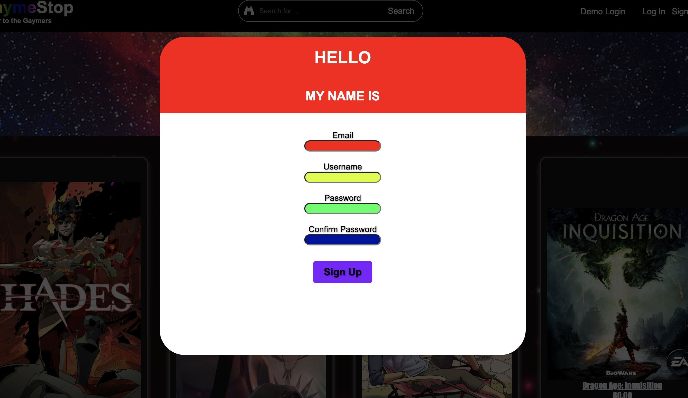
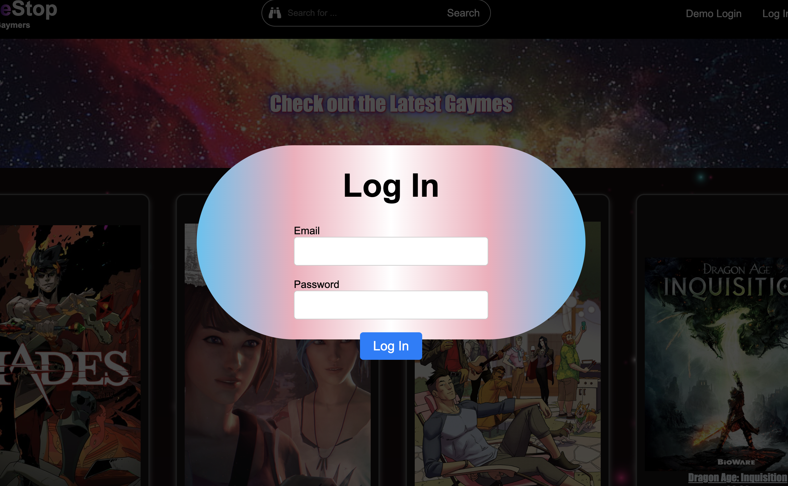
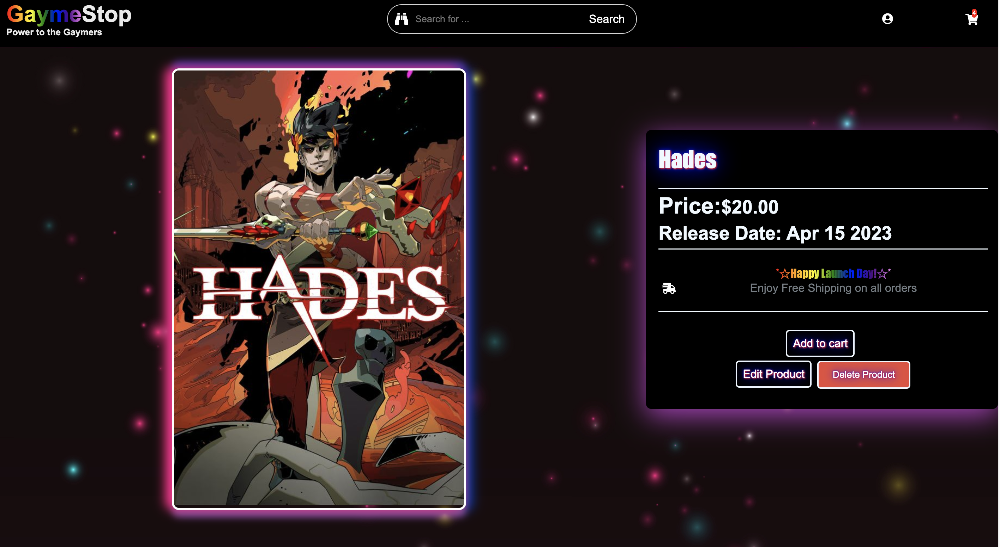
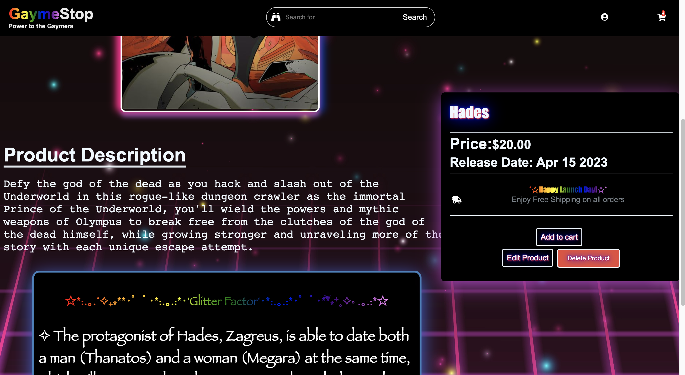
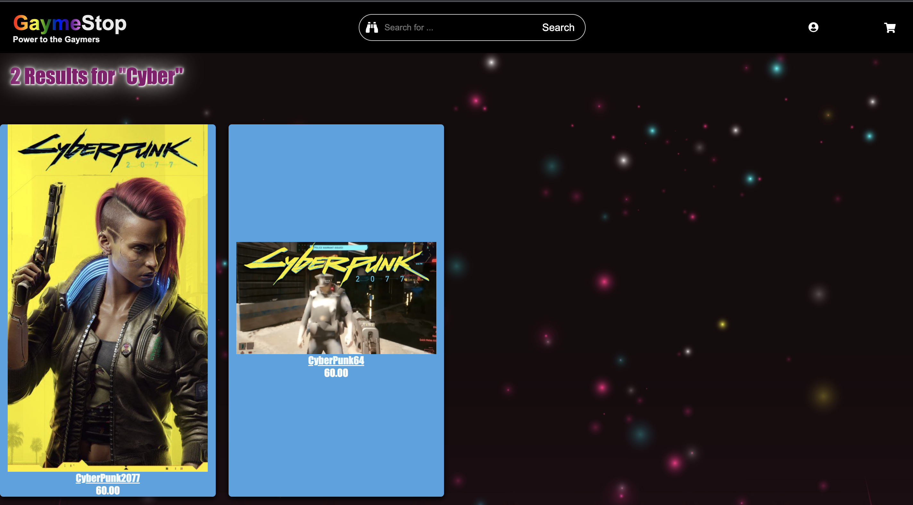
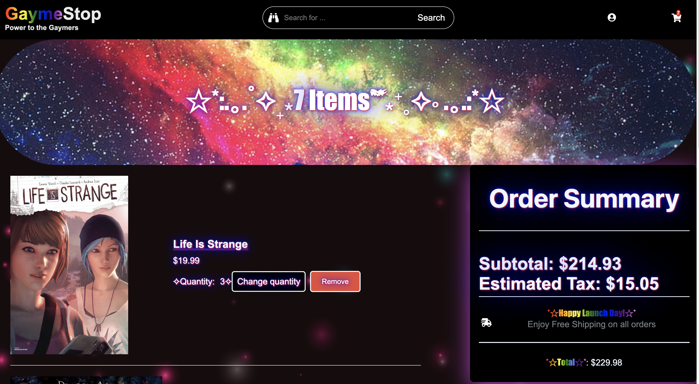
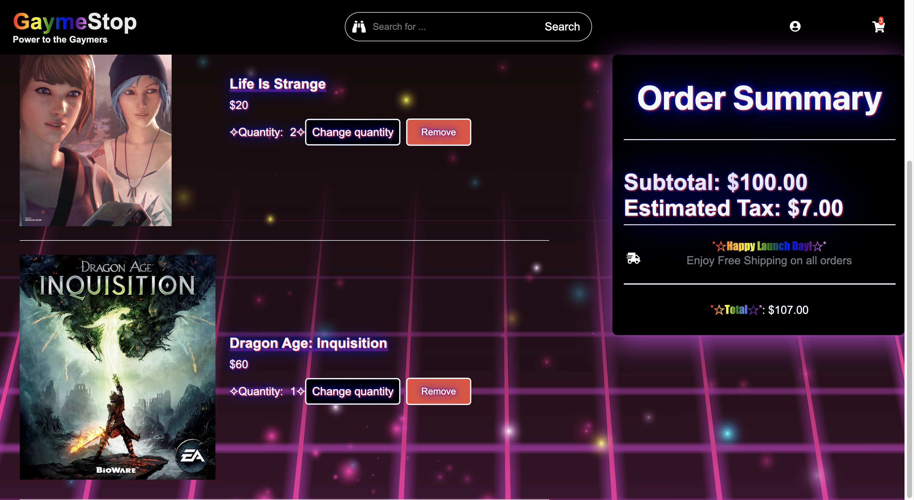

# GaymeStop
TESTING
## Power to the Gaymers!

GaymeStop, a GameStop clone, where users can browse, search, and (mock) purchase LGBTQ+ curated video games with their own representational emphasis known as "Glitter Factor".

# Images

## Homepage

## Sign Up

## Log In

## Product Page

(cont.)

## Search Feature


## User Cart

(cont.)



# Getting started
1. Clone this repository

2. Install backend dependencies

      ```bash
      pipenv install
      ```

3. Create a **.env** file based on the example with proper settings for your
   development environment

4. Make sure the SQLite3 database connection URL is in the **.env** file

5. This starter organizes all tables inside the `flask_schema` schema, defined
   by the `SCHEMA` environment variable.  Replace the value for
   `SCHEMA` with a unique name, **making sure you use the snake_case
   convention**.

6. Get into your pipenv, migrate your database, seed your database, and run your Flask app with:

   ```bash
   pipenv shell
   ```

   ```bash
   flask db upgrade
   ```

   ```bash
   flask seed all
   ```

   ```bash
   flask run
   ```

7. To run the React App in development, open another terminal window and cd into **react-app**
8. Install frontend dependencies.
```bash
npm install
```

9. While in development, run this application from this location using
```bash
npm start
````

### Notes
   - No environment variables are needed to run this application in development, but be sure to set the REACT_APP_BASE_URL environment variable when you deploy!

   - This app will be automatically built when you push to your main branch on Github.

   - This project was bootstrapped with [Create React App](https://github.com/facebook/create-react-app).


### This project uses the following technologies
### Frontend
* Javascript
* React
* Redux
* FontAwesome
### Backend
* Python
* Flask
* SQLAlchemy
* Alembic
* SQLite3 (development)
* PostgreSQL (production)

# CRUD Features

## Users
Allows you to:
   - Log in
   - Sign up
   - Use the DEMO USER login
   - Have access to a shopping cart

## Products
   - All users can view the products and their individual showcases.

Non-logged in users can:
   - Explore Product Showcases
   - Search for Products

Logged in users can:
   - Post products
   - Edit and Delete your own products

## Cart
 - Only accessable to logged in users

A logged in user can:
 - Add a Product to their cart.
 - View the Products in their cart and the quantity of each
 - Edit and delete a Products Quantity
 - Remove an item from their cart

 ## Search

- All users can search for products

## Amazon Web Services Simple Storage Service (AWS S3)
   -Users will upgrade from providing URL links for Product Images to:
   - Uploading an image file from their local device
   - Storing image data to the Amazon cloud


# Future Features

## This clone is a work in progress, these features will be available in the future...
- ## Ratings
    -Users will be able to:
     - write reviews for products and rate them out of 5 stars

- ## User Public Page/Private Settings
   -Users will be able to view/edit their private information, and choose to have an optional public page and what information to display

   -A User can chose to display this data on their Public Profile:

      - Username (mandatory with Public Profile option)
      - Profile Picture
      - "Member Since" Date
      - Products
      - Category Preferences
      - Wishlist
      - Reviews


   -Private Settings will house a users public/private information with the option to edit:

      - Username, Email, Password
      - Phone Number
      - Shipping Address
      - Saved Credit/Debit Cards
      - Public Profile option


- ## WishList
   -Users will have a Wishlist they can:

      - View from their cart
      - Post on their Public Page
      - Add/Remove from either the Product Page or in Private settings
- ## Most Popular Products Page
   -Dedicated to the Products with the highest ratings

- ## Newest Products Page
   -See the latest posted Products

- ## Multidimensional Search/Filter
   -Products will be organized by tags which all users can use to filter categories in their search

   - Tags to be included:

         - Product Genre
         - Price Range
         - Sexuality Featured in Product
